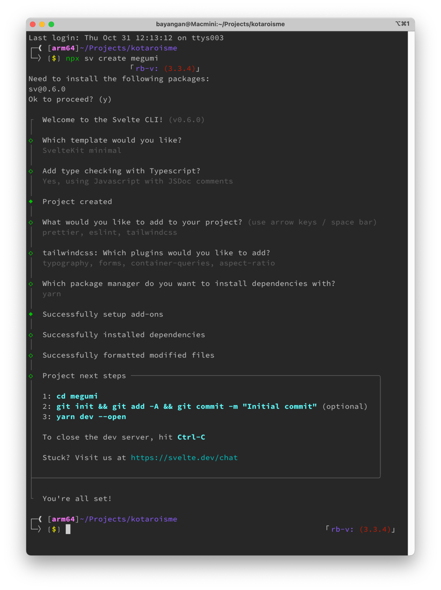
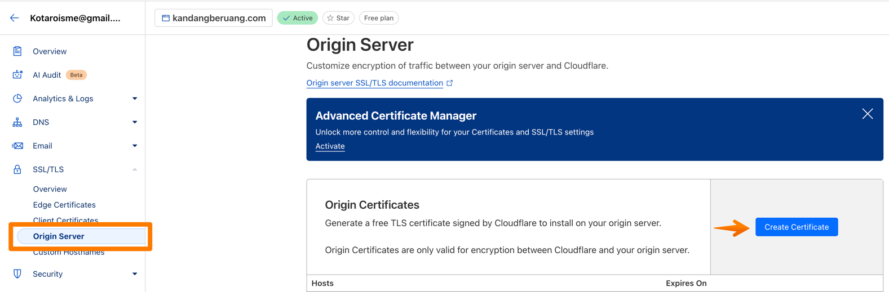

# Setup Project "Megumi"

## Setup Initial Commit
```bash
# Create new Svelte project
npx sv create megumi
```



```bash
yarn set version 4.4.1
yarn install
# Run linting
yarn lint

# Format code
yarn format

yarn check

# Start development server with open option
yarn dev --open

```
change code in +page.svelte

```html
<container class="flex h-screen items-center justify-center bg-orange-500">
    <div class="font-bold text-white">
        Welcome to event<span class=" text-[2rem]">"Deployment [FE]"</span><br />
    </div>
</container>
```


```bash
# Initialize Git repository
git init

# Add remote origin
git remote add origin https://github.com/kotaroisme/megumi.git
```

## Setup Husky
```bash
# Add Husky and lint-staged for pre-commit hooks
yarn add husky lint-staged --dev
npx husky init

# add to .husky/pre-commit
# npx --no-install lint-staged
```

add to package.json

```json
{
  ...,
  "license": "MIT",
  "private": true,
  ...,

  "lint-staged": {
    "**/*.{js,ts,svelte}": [
      "yarn run lint"
    ]
  }
}
```


## Setup Vercel
```bash
yarn add -D vercel
vercel
```

## Setup Docker
```bash
yarn add -D @sveltejs/adapter-node
```

Change svelte.config.js
```js
// import adapter from '@sveltejs/adapter-auto';
import adapter from '@sveltejs/adapter-node';
```

```bash
touch .dockerignore
touch Dockerfile

docker build --no-cache -t megumi .
docker run -p 3000:3000 megumi
```

## Setup Server

ROOT
```bash
sudo adduser deployer
usermod -aG sudo deployer
visudo # -> deployer ALL=(ALL) NOPASSWD:ALL
visudo # -> %sudo ALL=(ALL) NOPASSWD:ALL
su - deployer # switch user
```


USER
```bash
ssh-keygen -t ed25519 -C "deployer@kotarois.me"
cat .ssh/id_ed25519.pub # -> copy and append to authorized_keys
touch .ssh/authorized_keys
nano .ssh/authorized_keys # paste here

# install Docker
# https://docs.docker.com/engine/install/ubuntu/

sudo apt  install  make
sudo usermod -aG docker $USER
sudo reboot
```

## Config Github ENV
Add env variable to current repo
current repo > settings > Secrets and variables > Action > choose tab Secret > Repository secrets -> New Repository secret
```bash
Name: VERCEL_TOKEN
Secret: ****

# -------------

Name: SSH_PRIVATE_KEY_SERVER
Secret: ****

# -------------

Name: SSH
Secret: deployer@123.123.123.12
```

How to get SSH_PRIVATE_KEY_SERVER ?
```bash
ssh deployer@123.123.123.12
cat .ssh/id_ed25519 # -> copy and paste to SSH_PRIVATE_KEY_SERVER
```

## Github workflow
Open assets/.github/workflows
Choose one, ex: [deploy_server.yml](assets/.github/workflows/deploy_server.yml)
```html
.github
|-- workflow
|---- [deploy_server.yml](assets/.github/workflows/deploy_server.yml)

```

## Setup Code
run line by line in:
[setup.sh](assets/setup.txt)

## Setup SSL


add to assets > config > ssl

# DONE!